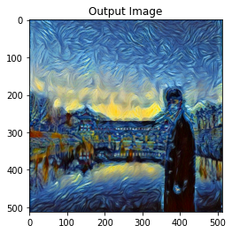
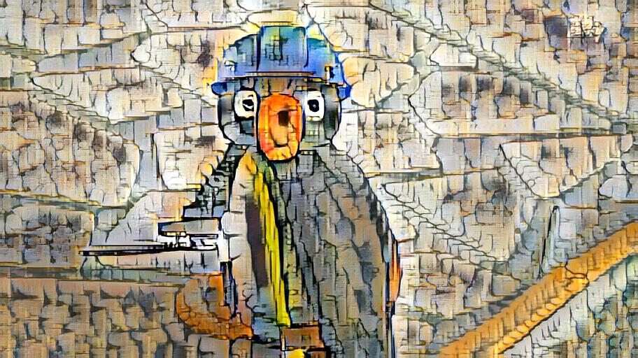
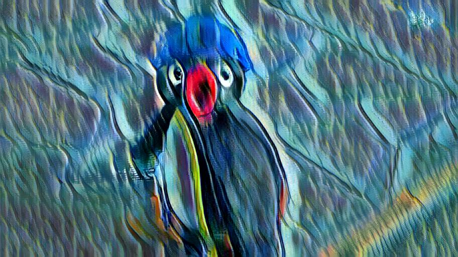
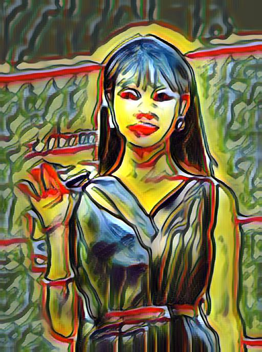
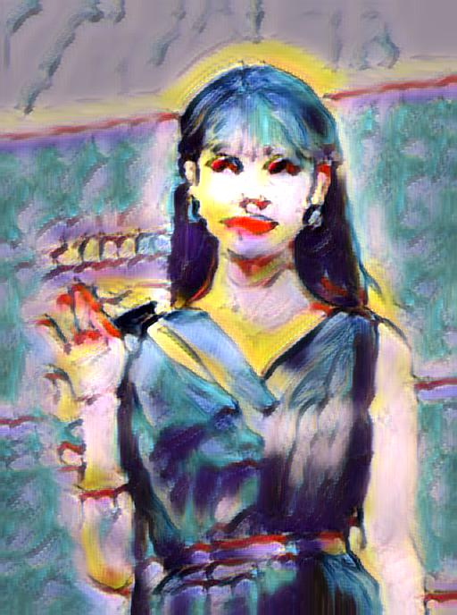
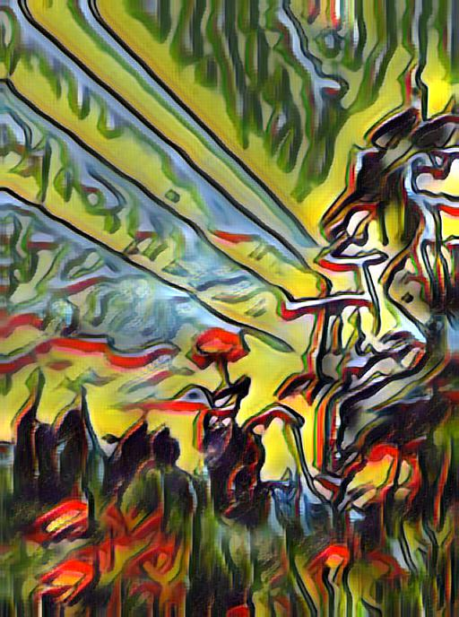
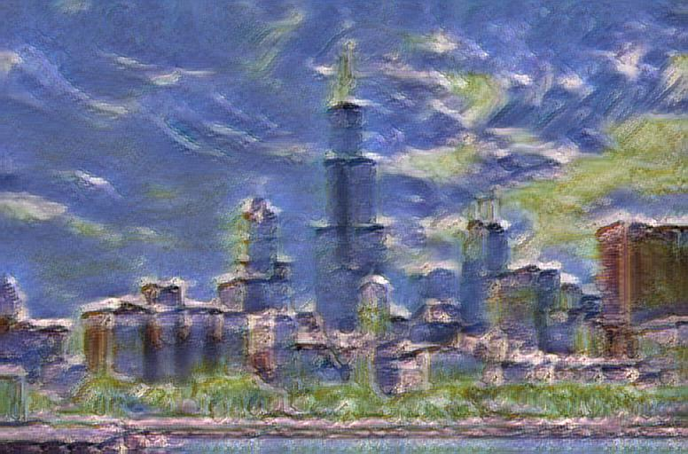
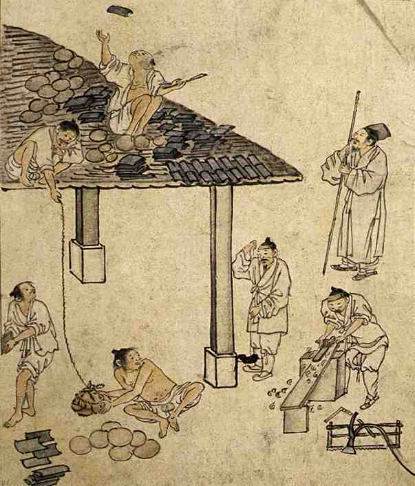
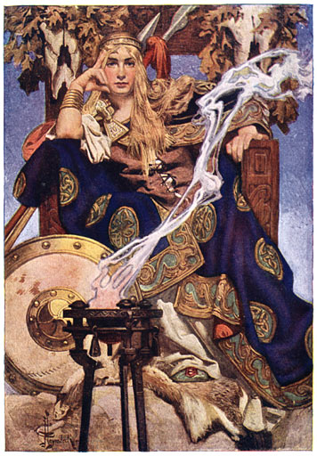
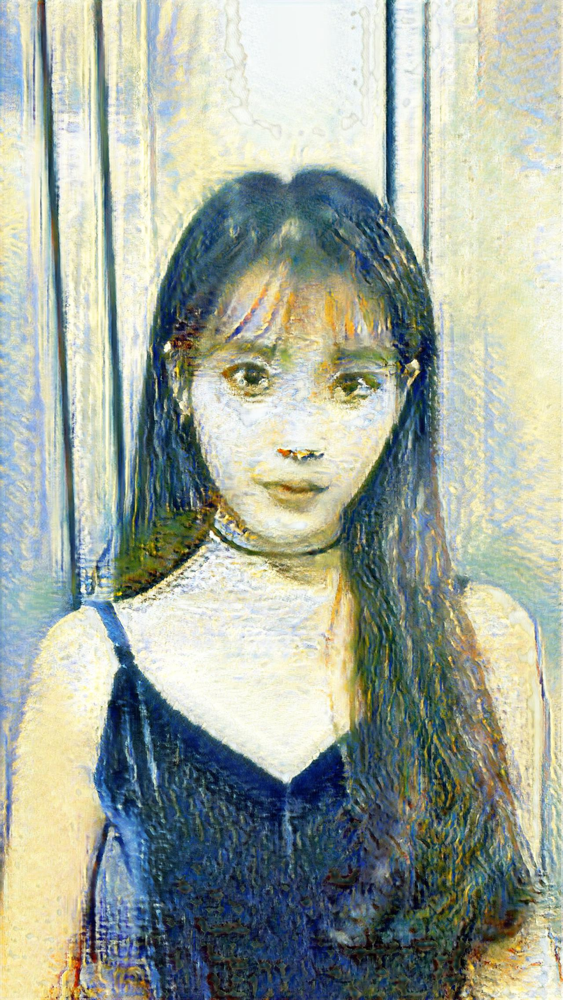

# Style Transfer

neural style transfer 방식은 3가지가 있습니다.

1. pre-trained된 모델을 기반으로 content image와 style image을 입력으로 이용해 이미지를 학습 하는 방법

   - 장점
     - 이미지 2장(content image와 style image)만으로 style transfer가 가능

   - 단점
     - 새로운 content 이미지를 변환하거나, 또는 새로운 style로 변환할 경우 다시 학습해야 함

2. pre-trained된 모델을 기반으로 content image와 style image을 입력으로 이용해 이미지 변환 네트워크를 학습하는 방법

   - 장점

     - 이미지 2장(content image와 style image)만으로 style transfer가 가능

     - 새로운 content 이미지를 변환할 경우, 학습된 이미지 변환 네트워크에 대해 feed-forward만 하면 되고 따라서 재학습이 필요 없고 실시간 변환이 가능

   - 단점
     - style image는 대체로 그림(artistic image)로 한정되는 듯.

3. encoder-decoder을 기반으로 style transfer 모델을 직접 학습하는 방법

   - 장점

     - 생성 모델이 학습되면, 새로운 content 이미지를 변환 할 경우 feed-forward만 하면 되고 따라서 재학습이 필요없고 실시간 변환이 가능

     - style image에 제한이 없는 듯(photo-realistic 변환 가능)

   - 단점
     - 학습을 위한 많은 데이터셋 확보가 필수적일 것

- 결과

| 모델 | 소요시간 | 퀄리티 | 평가                                                         |
| ---- | -------- | ------ | ------------------------------------------------------------ |
| 1    | 40초     | 안좋음 | 사진마다 하이퍼파라미터를 많이 고쳐줘야함                    |
| 2-1  | 5초      | 중     | 학습된 화풍이 많이 존재하지 않음.. 그리고 비슷비슷한거 같은 느낌? |
| 2-2  | 5초      | 중     | 10000번 정도 돌림 (40분정도..?)  - 학습시간을 늘려보면 어떻게 될지 |
| 3    | 15초     | 중상   |                                                              |

## 1 번

> pre-trained된 모델을 기반으로 content image와 style image을 입력으로 이용해 이미지를 학습 하는 방법
>
> https://pytorch.org/tutorials/advanced/neural_style_tutorial.html
>
> 파이토치 튜토리얼 대로 [코랩](https://colab.research.google.com/drive/16SAT-Lj4ot8vkaLW1s_lNOahkGReFqZt?usp=sharing)에서 실행

- Input

- output

➡ 소요시간 : 40초 / 결과물이 불규칙하고, 데이터마다 하이퍼 파라미터를 계속 수정해줘야함. 따라서 우리의 서비스에 사용하기엔 적합하지 않아보임.

 

## 2 번

> pre-trained된 모델을 기반으로 content image와 style image을 입력으로 이용해 이미지 변환 네트워크를 학습하는 방법
>
> https://github.com/naoto0804/pytorch-AdaIN
>
> 깃허브에서 코드를 받아와서 사용

### pretrained

- input

- output

➡ 소요시간 : 5초 // 퀄리티 중간정도..?

- pretrained style

 

 

 

➡ 이미 학습된 화풍이 많지 않고, 비슷한 부분이 많이 존재하는 거 같다.

### 1st train in colab 

> [코랩](https://colab.research.google.com/drive/1XOXjnEDCBsiDF6MyJNSf0zUw6gYuhuq4?usp=sharing) 에서 학습시켜봄
>
> --batch_size 4 --max_iter 10000 : 40분정도 걸림

- 아이유

  

  

  

- 배경

  

  

  

- 규수(test데이터)

  

  

  

➡ 소요시간 5초이내 // 퀄리티 굉장히 기괴함.. 학습 시간을 좀 늘리면 달라지려나...?

### 2nd train in colab 

> [코랩](https://colab.research.google.com/drive/1XOXjnEDCBsiDF6MyJNSf0zUw6gYuhuq4?usp=sharing) 에서 학습시켜봄
>
> --batch_size 4 --max_iter 20000 : 1시간14분

#### 이전 모델과 비교 (고흐)

1만번 학습 - 원본 - 2만번 학습

- 아이유

- 배경

  

- 규수 (test데이터)

#### 새로운 화풍 학습

- 모네

- 김홍도 

- 조지프 크리스천 레이엔데커

## 3 번

> encoder-decoder을 기반으로 style transfer 모델을 직접 학습하는 방법
>
> [깃허브](https://github.com/CompVis/adaptive-style-transfer)

## 실험중

1. 3번모델에 있는 작가들 중에서 3개 선택해서 // 화가 3개를 다 넣어서 학습시킨 2번 모델1개 // 3개를 각각 학습시켜서 2번 모델 3개 만들기

