# 전체코드는 심사중이기에 업로드 하지 않았습니다. 최종 승인이 날 경우, 전체 코드를 업로드하도록 하겠습니다 :)

<br>

# 👩‍🎨그림이 널 만났을 때(GNM)

[](https://youtu.be/h-wyGbILr9c)

👆 Teaser (Youtube-36초)


<br>

## 📌개요

> 안녕하세요. 온라인 인터렉티브 전시회, <span style="color:#2a433b">그림이 널 만났을 때</span>입니다.
>
> 코로나를 비롯해 여러가지 이유로 인해 문화생활을 즐기지 못하는 사람들을 위해, 온라인 전시회를 개최합니다. Interactive한 요소를 활용하여 그림과 사용자가 만났을 때, 하나의 작품이 완성됩니다. 마지막으로 전시회를 관람해주신 분들에게 **화가 분들이 여러분의 일상을 그려 선물해드립니다!** 
>
> (사실은 Style Tranfer AI 모델을 학습시켜서, 일상 사진을 올리면 화가 화풍에 맞게 변환시켜줍니다😅)
>
> 

- **개발 기간** : 2021.03.02 ~ 2021.04. 09(총 6주)
- **개발 환경** :  EC2, Git, Jira
- **프로젝트 이름** : 그림이 널 만났을 때 (GNM)
- **슬로건 :** 온라인 인터렉티브 전시회
- **사이트 링크:** - 차후 공개하겠습니다
- **내 역할** 
  - 프론트엔드개발자 / 총 5명
  - API,Vuex를 활용하여 방명록 페이지 개발
  - Vuex 기반 지도,음성 아이콘 컴포넌트화
  - Klimt 전시회 페이지 개발
  - EC2, Nginx를 활용한 Frontend & Backend 배포

<br>

## 📌서비스 흐름

[초기 기획](assets/docs/6팀_기획안_발표자료.pdf)


### 유저 케이스

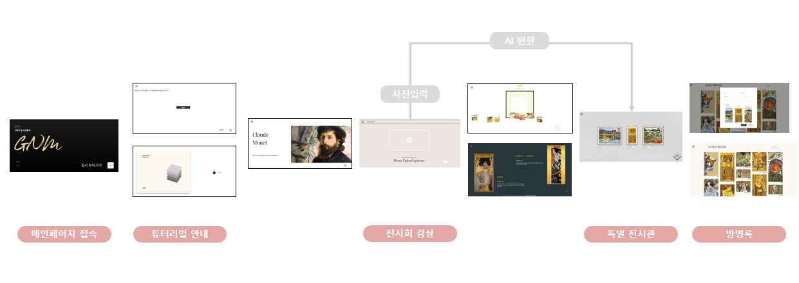

### 아키텍쳐

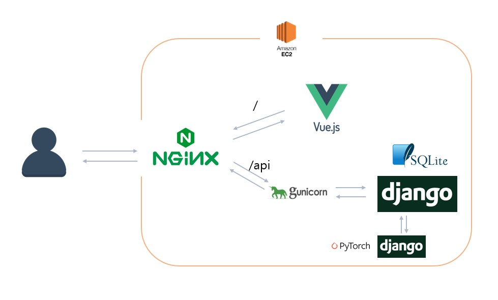

<br>

## 📌주요기능

Frontend 관점으로 작성하였습니다.

### 메인페이지


전시회 광고를 목적으로 인터렉티브 요소를 넣음으로써 흥미 유발.

### 튜토리얼 

> 지도, 음성 아이콘을 재사용할 수 있도록 컴포넌트화 하였습니다.

- 아이콘 설명

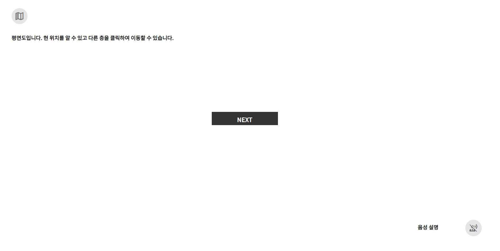

- 지도 UI

| UI1                                   | UI2                            |
| ------------------------------------- | ------------------------------ |
| 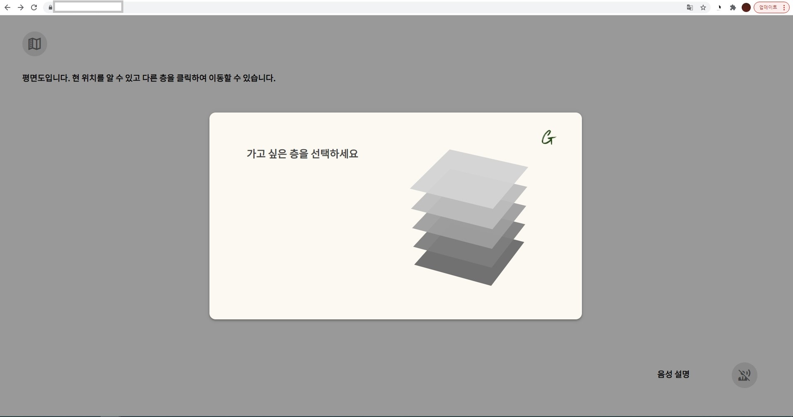 | 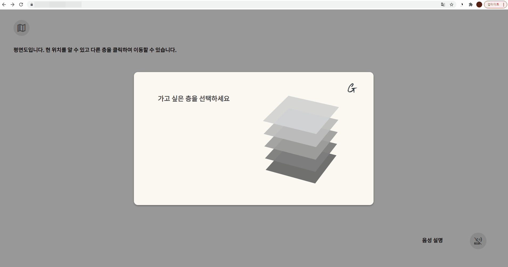 |

일반적인 웹사이트와 달리 전시회에 온 것 같은 느낌을 주기 위해, 전시회 팜플렛기능을 하는 **지도**와 ,  도슨트역할을 하는 **음성**을 활용하였습니다.

-  전시회 지도 설명

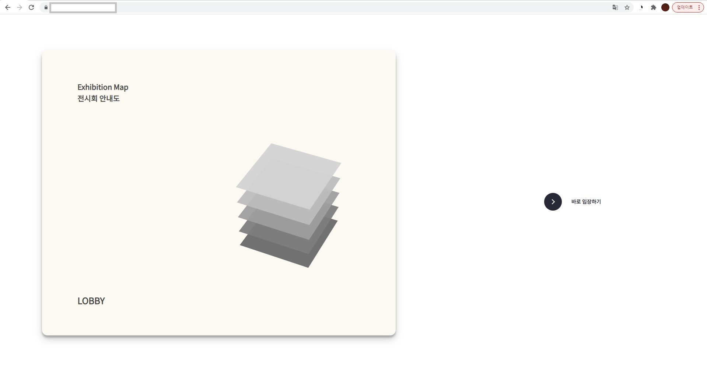

1. 기본적인 전시 순서가 존재하지만, 보고싶은 전시를 먼저 볼 수 있도록
2. 앞서 지도 아이콘을 제대로 보지 않는 사람들에게 지도 기능을 다시 한번 설명하는 목적으로

### 전시회 특징

- 화가별 인터렉티브요소

| Monet                                  | Klimt                                  | 천경자                                 |
| -------------------------------------- | -------------------------------------- | -------------------------------------- |
|  |  | 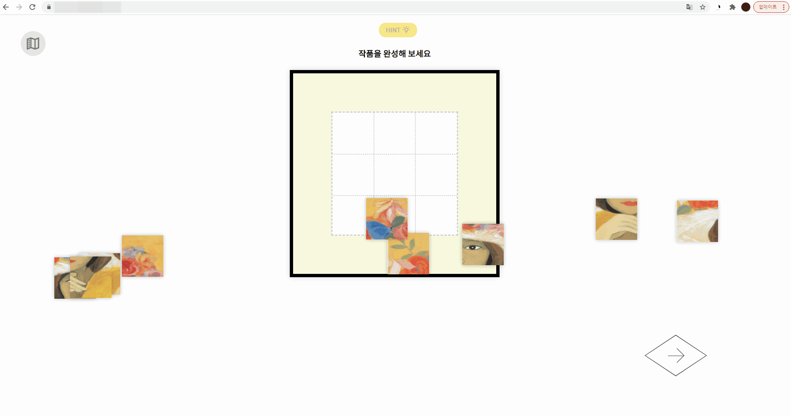 |

- 가로스크롤 + 애니메이션


가로스크롤, 애니매에션을 통해 전시에 몰입할 수 있도록 하였습니다. 또한 가로스크롤를 컴포넌트로만들어서 다른 전시에서 데이터만 바꿔서 재사용할 수 있도록 하였습니다.  Vuex기반으로 페이지변수와 routeName를 통해 작품에 맞는 음성안내가 되도록 하였습니다.

### 사진업로드

| 사진업로드                              | 미업로드하고 진행시                     |
| --------------------------------------- | --------------------------------------- |
|  | 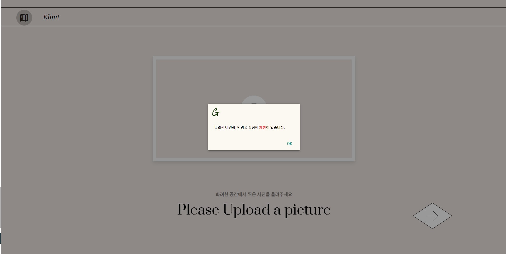 |

전시회는 로그인 기능을 제공하고 있지 않습니다. 따라서 사용자와 사진을 매핑하기 위해 Session ID를 활용하고 있습니다. 최초 액자 프레임을 클릭하여 사진을 업로드할 때, Session ID를 생성하고 브라우저 storage에 저장합니다. 이후 진행을 위해 오른쪽 아래 버튼을 클릭시, Session ID와 사진을 함께 DB에 보내고 매핑하여 저장합니다. 사진을 업로드하지 않는다면, AI가 변환한 사진을 활용하는 컨텐츠를 제공하는데 제한이 발생한다는 것을 알려줍니다.

### 특별전시

| 리스트                                 | 디테일                                 |
| -------------------------------------- | -------------------------------------- |
| 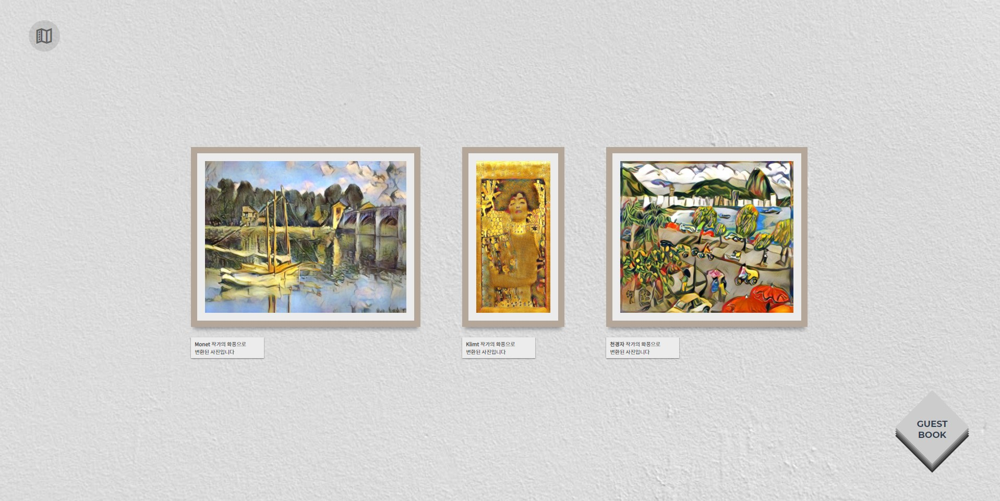 | 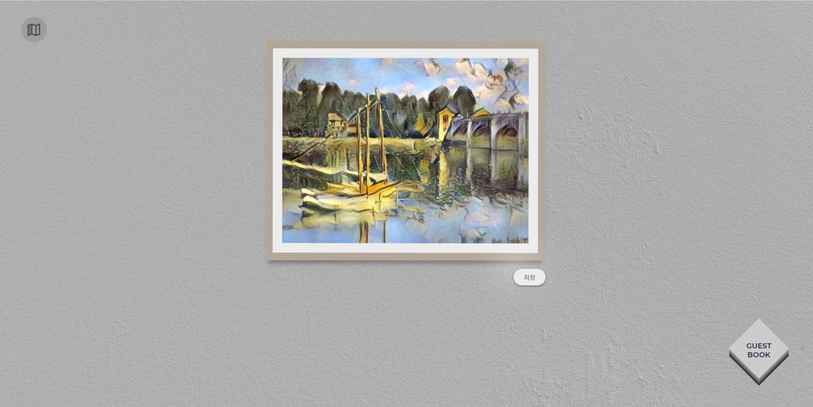 |

AI가 변환하는 데 약간의 시간이 걸리기 때문에 특별전시 페이지에서 보여주도록 구성하였습니다. 사진을 클릭하면 보다 크게 그림을 볼 수 있으며, 저장기능을 제공하고 있습니다.

### 방명록

| 리스트                                     | 디테일                                     |
| ------------------------------------------ | ------------------------------------------ |
| 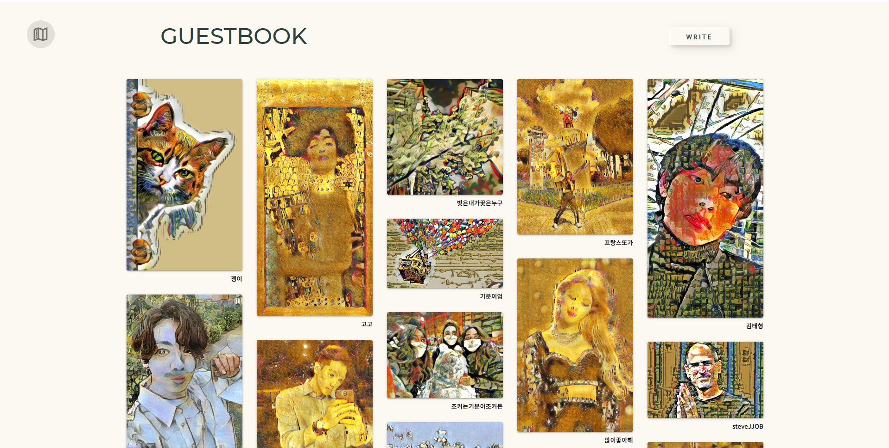 | 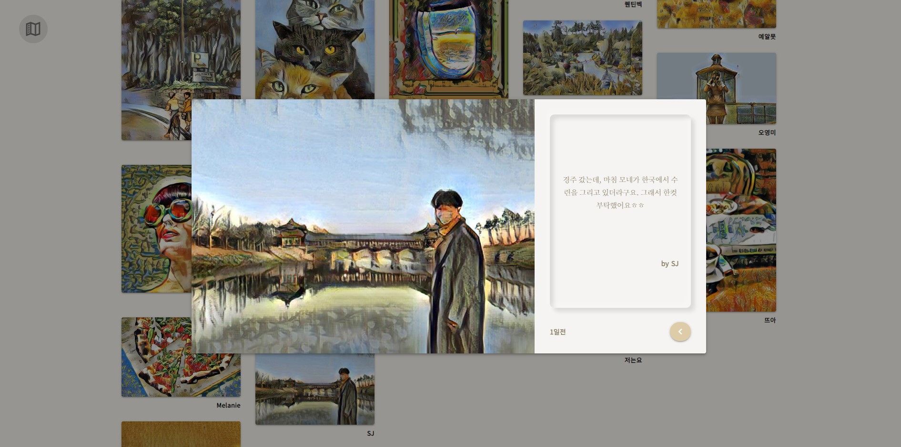 |

| 방명록작성form                             | form validate                              |
| ------------------------------------------ | ------------------------------------------ |
| 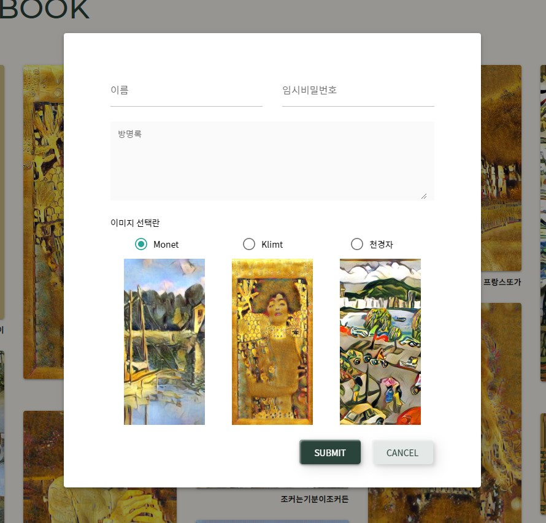 | 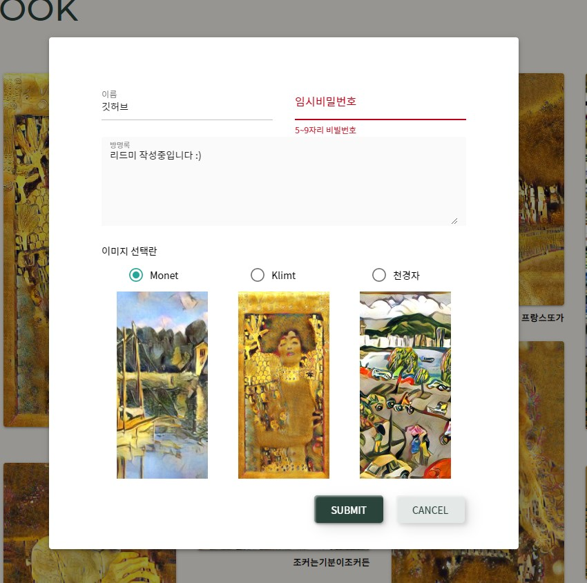 |

방명록 페이지에 들어오게 되면, 브라우저에 있는 Session ID를 통해 변환된 이미지를 매핑하여 가져옵니다. 그리고 글을 작성할 땐, 임시 비밀번호를 활용하여 수정,삭제가 가능하게 하였습니다. form validater 를 사용하였습니다.


<br>

## 📌프로젝트 설정 및 실행 방법


- frontend

```bash
cd frontend
npm i 
npm run serve
```

- backend

```bash
$ cd backend
$ python -m venv venv
$ source venv/Scripts/activate
$ pip install -r requirements.txt
$ python manage.py makemigrations
$ python manage.py migrate
$ python manage.py runserver
```

- AI

```python
# backend galleries/views.py
...
# 로컬 주소
base_url = 'http://127.0.0.1:'
# 해당 ai모델 연결
artist = ['monet/', 'klimt/', 'chun/']
# 해당 ai모델 포트 번호
port_num = ['8001/', '8002/', '8003/']
port_num = port_num[no - 1]
artist = artist[no - 1]
ai_url = base_url + port_num + artist

print(f'요청 보내는 주소: {ai_url}')
...
```

```
# window OS
# asgiref==3.3.1
# certifi==2020.12.5
# Django==3.1.7
# djangorestframework==3.12.3
# imageio==2.9.0
# mkl-fft==1.3.0
# mkl-random==1.1.1
# mkl-service==2.3.0
# numpy==1.17.2
# olefile==0.46
# opencv-python==4.4.0.46
# Pillow==7.1.0
# protobuf==3.9.1
# pytz==2021.1
# six==1.12.0
# sqlparse==0.4.1
# tensorboardX==1.8
# torch==1.8.1
# torchaudio==0.8.1
# torchvision==0.9.1
# tqdm==4.35.0
# wincertstore==0.2

# Linux
asgiref==3.3.1
certifi==2020.12.5
chardet==4.0.0
Django==3.1.7
djangorestframework==3.12.3
idna==2.10
imageio==2.9.0
numpy==1.17.2
olefile==0.46
opencv-python==4.4.0.46
Pillow==7.1.0
protobuf==3.9.1
pytz==2021.1
requests==2.25.1
six==1.12.0
sqlparse==0.4.1
tensorboardX==1.8
torch==1.8.1
torchaudio==0.8.1
torchvision==0.9.1
tqdm==4.35.0
typing-extensions==3.7.4.3
urllib3==1.26.4
wincertstore==0.2
```

```bash
$ conda create -n [env name] python=[version]

$ conda activate style_transfer
or
$ source activate style_transfer

# (처음 pull 받았다면) migrate 실행
$ python manage.py migrate
# Django runserver에서 .reload를 위해 2개의 프로세스를 띄움
$ python ./manage.py runserver --noreload 0.0.0.0:[port 번호] &
# 모네 - 8001, 클림트 - 8002, 천경자 - 8003 각자 manage.py 위치에서 실행

```

